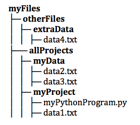

..  Copyright (C)  Brad Miller, David Ranum, Jeffrey Elkner, Peter Wentworth, Allen B. Downey, Chris
    Meyers, and Dario Mitchell.  Permission is granted to copy, distribute
    and/or modify this document under the terms of the GNU Free Documentation
    License, Version 1.3 or any later version published by the Free Software
    Foundation; with Invariant Sections being Forward, Prefaces, and
    Contributor List, no Front-Cover Texts, and no Back-Cover Texts.  A copy of
    the license is included in the section entitled "GNU Free Documentation
    License".

.. qnum::
   :prefix: files-2-
   :start: 1

Finding a File in your Filesystem
=================================

In the examples we have provided, and in the simulated file system that we've built for this online textbook, all files sit in a single directory, and it's the same directory where the Python program is stored. Thus, we can just write ``open('myfile.txt', 'r')``.

If you have installed Python on your local computer and you are trying to get file reading and writing operations to work, there's a little more that you may need to understand. Computer operating systems (like Windows and the Mac OS) organize files into a hierarchy of folders, with some folders containing other folders. 

If your file and your Python program are in the same directory you can simply use 
the filename. For example, with the file hierarchy in the diagram, the file `myPythonProgram.py` could contain the code ``open('data1.txt', 'r')``.

If your file and your Python program are in different directories, however, then you need to specify a **path**. You can think of the filename as the short name for a file, and the path as the full name. Typically, you will specify a *relative file path*, which says where to find the file to open, relative to the directory where the code is running from. For example, the file `myPythonProgram.py` could contain the code ``open('../myData/data2.txt', 'r')``. The ``../`` means to go up one level in the directory structure, to the containing folder (allProjects); ``myData/`` says to descend into the myData subfolder.

There is also an option to use an *absolute file path*. For example, suppose the file structure in the figure is stored on a computer in the user's home directory, `/Users/joebob01/myFiles`.  Then code in any Python program running from any file folder could open data2.txt via ``open('/Users/joebob01/myFiles/allProjects/myData/data2.txt', 'r')``. You can tell an absolute file path because it begins with a `/`.
If you will ever move your programs and data to another computer (e.g., to share them with someone else), it will be much more convenient if your use relative file paths rather than absolute. That way, if you preserve the folder structure when moving everything, you won't need to change your code. If you use absolute paths, then the person you are sharing with probably not have the same home directory name, `/Users/joebob01/`. Note that Python pathnames follow the UNIX conventions (Mac OS is a UNIX variant), rather than the Windows file pathnames that use `:` and `\\`. The Python interpreter will translate to Windows pathnames when running on a Windows machine; you should be able to share your Python program between a Windows machine and a MAC without having to rewrite the file open commands.

.. note::

   For security reasons, our code running in your browser doesn't read or write files to your computer's file 
   system. Later, when you run Python natively on your own computer, you will be able to truly read files, using 
   path names as suggested above. To get you started, we have faked it by providing a few files that you can read 
   *as if* they were on your hard disk. In this chapter, we simulate the existence of one textfile; you can't open any other files from your local computer from textbook code running in your browser.

**Check Your Understanding**

.. mchoice:: question9_2_1
   :answer_a: open("YearlyProjections.csv", "r")
   :answer_b: open("../CompanyData/YearlyProjections.csv", "r")
   :answer_c: open("CompanyData/YearlyProjections.csv", "r")
   :answer_d: open("Project/CompanyData/YearlyProjections.csv", "r")
   :answer_e: open("../YearlyProjections.csv", "r")
   :correct: c
   :feedback_a: This would try to open a file inside of Project (but that is not where the file is.)
   :feedback_b: This would go to the parent directory of Project and look for a subdirectory of that called CompanyData. But CompanyData is inside Project so it wouldn't be found.
   :feedback_c: Yes, this is how you can access the file!
   :feedback_d: This would try to find a subdirectory Project of the current directory called Project.
   :feedback_e: Remember that '..' will bring you up one level to the parent directory. This would try to open a csv file in the parent directory of Project (but that is not where the file is.)
   :practice: T 

   Say you are in a directory called Project. In it, you have a file with your Python code. You would like to read in data from a file called "YearlyProjections.csv" which is in a folder called CompanyData, which is inside of Project. What is the best way to open the file in your Python program?

.. mchoice:: question9_2_2
   :multiple_answers:
   :answer_a: "Stacy/Applications/README.txt"
   :answer_b: "/Users/Raquel/Documents/graduation_plans.doc"
   :answer_c: "/private/tmp/swtag.txt"
   :answer_d: "ScienceData/ProjectFive/experiment_data.csv"
   :correct: a,d
   :feedback_a: Yes, this is a relative file path. You can tell by the lack of "/" at the beginning of the path.
   :feedback_b: This is an absolute file path. All absolute file paths start with "/".
   :feedback_c: This is an absolute file path. Not all absolute file paths contain "User"! Instead, check to see if the path starts with "/".
   :feedback_d: Yes, this is a relative file path. You can tell by the lack of "/" at the beginning of the path.
   :practice: T 

   Which of the following paths are relative file paths?
