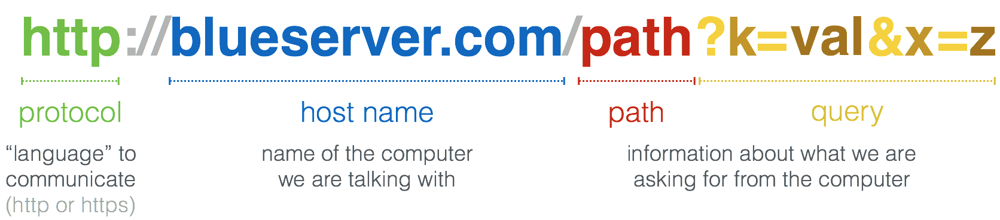

..  Copyright (C)  Paul Resnick.  Permission is granted to copy, distribute
    and/or modify this document under the terms of the GNU Free Documentation
    License, Version 1.3 or any later version published by the Free Software
    Foundation; with Invariant Sections being Forward, Prefaces, and
    Contributor List, no Front-Cover Texts, and no Back-Cover Texts.  A copy of
    the license is included in the section entitled "GNU Free Documentation
    License".

.. qnum::
   :prefix: requests-5-
   :start: 1

.. _rest_apis_chap: 

Using REST APIs
===============

REST stands for REpresentational State Transfer. It originally had a more abstract meaning, but has come to be a shorthand name for web sites that act a bit like python functions, taking as inputs values for certain parameters and producing outputs in the form of a long text string. 

API stands for Application Programming Interface. An API specifies how an external program (an application program) can request that a program perform certain computations.

Putting the two together, a REST API specifies how external programs can make HTTP requests to a web site in order to request that some computation be carried out and data returned as output. When a website is designed to accept requests generated by other computer programs, and produce outputs to be consumed by other programs, it is sometimes called a *web service*, as opposed to a *web site* which produces output meant for humans to consume in a web browser.

Of course, a web browser is just a computer program, so all requests to web sites come from other computer programs. But usually a browser requests data from a web site in order to display it directly to a human user of the browser.

Prior to the development of REST APIs, there were other ways that computer programs made remote requests to other computers on a network, asking them to perform some computation or retrieve some data. Those other techniques are still in use. REST APIs are particularly convenient, however, both for students and for others, because it is easy to see what is going on in a request and a response between two computers, and thus it is easier to debug.

We will examine a common pattern used in REST APIs, where there is a base URL that defines an "endpoint", and then additional information is appended to the URL as query parameters, and the response comes back not as HTML but as a format called JSON. Along the way, we will see some functions in python modules that are helpful for constructing the URLS and for processing the JSON formatted response.

.. _generating_request_urls:

URL Structure for REST APIs
---------------------------

In a REST API, the client or application program-- the kind of program you will be writing-- makes an HTTP request
that includes information about what kind of request it is making. Web sites are free to define whatever format
they want for how the request should be formatted. This chapter covers a particularly common and particularly
simple format, where the request information is encoded right in the URL. This is convenient, because if something
goes wrong, we can debug by copying the URL into a browser and see what happens when it tries to visit that URL.

In this format, the URL has a standard structure:

* the base URL
* a ``?`` character
* one or more key-value pairs, formatted as ``key=value`` pairs and separated by the ``&`` character.

For example, consider the URL `<https://itunes.apple.com/search?term=Ann+Arbor&entity=podcast>`_.
Try copying that URL into a browser, or just clicking on it. It retrieves data about podcasts posted from Ann Arbor, MI. Depending on your browser, it may put the contents into a file attachment that you have to open up to see the contents, or it may just show the contents in a browser window.

Let's pull apart that URL.

* the base URL: ``https://itunes.apple.com/search``
* a ``?`` character
* key=value pairs. In this case, there are two pairs. The keys are ``term`` and ``entity``. An ``&`` separates the two pairs.

All those parts are concatenated together to form the full URL.

Note that in the search term Ann Arbor, the space had to be "encoded" as ``+``. More on that below.

Encoding URL Parameters
-----------------------

Here's another URL that has a similar format. `<https://www.google.com/search?q=%22violins+and+guitars%22&tbm=isch>`_. It's a search on Google for images that match the string "violins and guitars". It's not actually based on a REST
API, because the contents that come back are meant to be displayed in a browser. But the URL has the same structure
we have been exploring above and introduces the idea of "encoding" URL parameters.

* The base URL is ``https://www.google.com/search``
* ``?``
* Two key=value parameters, separated by ``&``
   * ``q=%22violins+and+guitars%22`` says that the query to search for is "violins and guitars".
   *  ``tbm=isch`` says to go to the tab for image search

Now why is ``"violins and guitars"`` represented in the URL as ``%22violins+and+guitars%22``? The answer is that
some characters are not safe to include, as is, in URLs. For example, a URL path is not allowed to include the double
-quote character. It also can't include a ``:`` or ``/`` or a space. Whenever we want to include one of those characters in
a URL, we have to *encode* them with other characters. A space is encoded as ``+``. ``"`` is encoded as ``%22``.
``:`` would be encoded as ``%3A``. And so on.