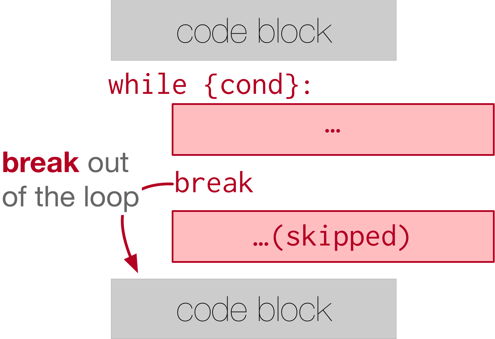
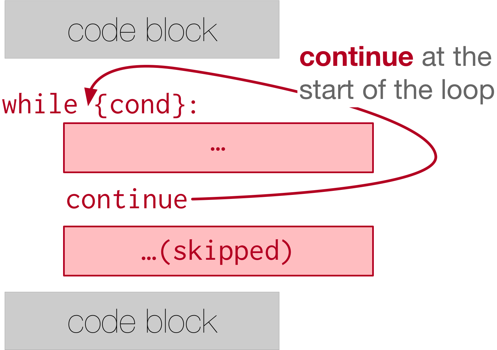

..  Copyright (C)  Brad Miller, David Ranum, Jeffrey Elkner, Peter Wentworth, Allen B. Downey, Chris
    Meyers, and Dario Mitchell.  Permission is granted to copy, distribute
    and/or modify this document under the terms of the GNU Free Documentation
    License, Version 1.3 or any later version published by the Free Software
    Foundation; with Invariant Sections being Forward, Prefaces, and
    Contributor List, no Front-Cover Texts, and no Back-Cover Texts.  A copy of
    the license is included in the section entitled "GNU Free Documentation
    License".

.. qnum::
   :prefix: moreiter-5-
   :start: 1

Break and Continue
------------------

Python provides ways for us to control the flow of iteration with a two keywords: break and continue.

``break`` allows the program to immediately 'break out' of the loop, regardless of the loop's conditional structure.
This means that the program will then skip the rest of the iteration, without rechecking the condition, and just goes on 
to the next outdented code that exists after the whole while loop.

 the bottom. It says "code block". An arrow points from the word break to the unindented block at the bottom and the phrase "break out of the loop" is written.

.. activecode:: ac14_5_1
    
    while True:
        print("this phrase will always print")
        break
        print("Does this phrase print?")

    print("We are done with the while loop.")

We can see here how the print statement right after ``break`` is not executed. In fact, without using break, we have no 
way to stop the while loop because the condition is always set to True!

``continue`` is the other keyword that can control the flow of iteration. Using ``continue`` allows the program to 
immediately "continue" with the next iteration. The program will skip the rest of the iteration, recheck the condition, 
and maybe does another iteration depending on the condition set for the while loop.

 is at the bottom. It says "code block". An arrow points from the word continue to the while conditional statement at the top of the while loop. The phrase "continue at the start of the loop" is written.

.. activecode:: ac14_5_2

    x = 0 
    while x < 10:
        print("we are incrementing x")
        if x % 2 == 0:
            x += 3
            continue
        if x % 3 == 0:
            x += 5
        x += 1
    print("Done with our loop! X has the value: " + str(x))

Try stepping through the above code in codelens to watch the order that the code is executed in. Notice in the first 
iteration how the program doesn't move to evaluate the divisible by 3 statement or add 1 to x. Instead, it continues to
the next iteration.
