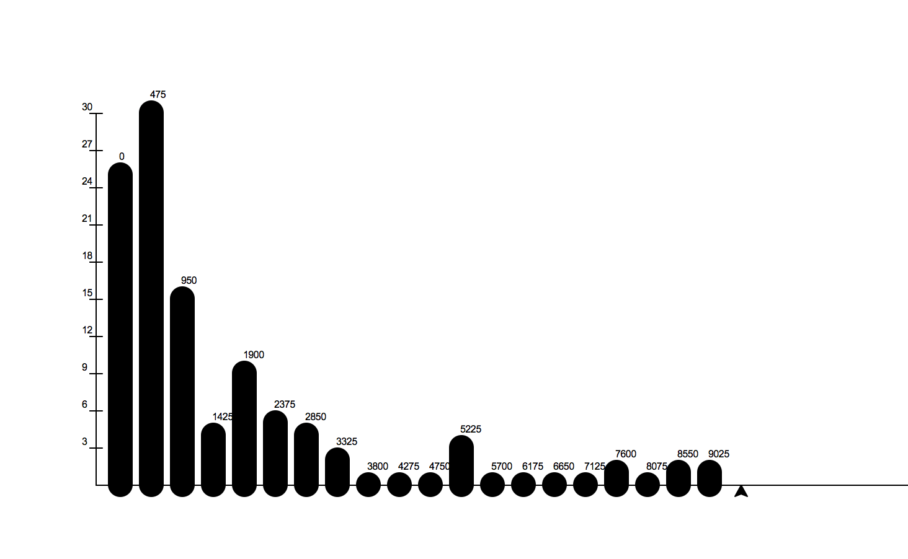

..  Copyright (C)  Google LLC, Runestone Interactive LLC
    This work is licensed under the Creative Commons Attribution-ShareAlike 4.0 International License. To view a copy of this license, visit http://creativecommons.org/licenses/by-sa/4.0/.

:skipreading:`True`

.. _kiva_graphs:

🤔 Graphing Kiva Data with the Turtle
=======================================

Computing statistics about numbers gives you a pretty narrow understanding of your data.  Its really important to look at your data visually, that is to graph it.  While there are many tools that you can use to graph your data, for this project we'll be coding our own graphs from scratch.  Don't worry in the next lab we'll explore one of the many high powered graphing tools that will will make the process easier.  Its good to know how the tools work behind the easy to use interface, and writing the code for some of these tools makes for a good learning experience.  Or as my dad would say:  "It builds character."

We will use turtle graphics to build three very useful graphs:

* A Bar Chart
* A Scatter plot
* A Histogram

Bar Chart
---------

A bar chart is a 2-dimensional plot that has a label on one axis (usually the X axis) and a value on the other axis (usually the Y axis).  If the label is on the X axis we call it a vertical bar chart, and if the label is on the y axis we call it a horizontal bar chart.

The goal of this first exercise is to reproduce a bar chart that looks like this:

.. image:: Figures/bar_chart.png

You can re-use the the ``unique_country`` list from the last project or if you have read enough about conditionals and list mutation you can make your own list of unique countries.  This will allow you to count the number of loans made for each country.

To draw the bars you can cheat a litte bit and just make your turtle really fat by using a width of about 20.  If you want to be really nice and precise you can draw a filled rectangle with the turtle too.

You should get the basics of the bar chart working first.  Your very first try is likely to be kind of short and generally not very good looking.  You'll want to experiment with a scale factor to make your Y values lengthen themselves a bit.  Later come back and draw the axes and scale and the labels for each country.

The data for this project is from the same original data set as the previous project, but we have provided a larger sample this time around.

.. activecode:: act_kiva_graph_data
    :nocodelens:

    loan_amount = [175.0, 4075.0, 250.0, 725.0, 875.0, 475.0, 800.0, 1050.0, 350.0, 1200.0, 700.0, 1500.0, 300.0, 1300.0, 725.0, 1325.0, 1050.0, 2650.0, 1500.0, 525.0, 100.0, 800.0, 300.0, 475.0, 250.0, 1050.0, 175.0, 275.0, 500.0, 125.0, 900.0, 250.0, 725.0, 950.0, 325.0, 375.0, 475.0, 1200.0, 550.0, 2500.0, 475.0, 350.0, 1575.0, 625.0, 1100.0, 275.0, 450.0, 275.0, 500.0, 500.0, 225.0, 425.0, 375.0, 100.0, 375.0, 225.0, 225.0, 400.0, 300.0, 500.0, 1150.0, 1500.0, 1300.0, 1125.0, 125.0, 475.0, 1775.0, 75.0, 400.0, 4200.0, 475.0, 175.0, 3600.0, 300.0, 200.0, 600.0, 325.0, 2500.0, 175.0, 1125.0, 225.0, 700.0, 1625.0, 250.0, 225.0, 225.0, 625.0, 175.0, 400.0, 375.0, 475.0, 600.0, 650.0, 575.0, 300.0, 650.0, 325.0, 950.0, 675.0, 175.0]

    country_name = ['Philippines', 'Costa Rica', 'Ghana', 'Vietnam', 'Honduras', 'Kenya', 'Guatemala', 'Togo', 'Peru', 'Lebanon', 'Bolivia', 'Kenya', 'Philippines', 'Kyrgyzstan', 'Vietnam', 'Colombia', 'Peru', 'Guatemala', 'El Salvador', 'Tanzania', 'Cambodia', 'Cambodia', 'Ghana', 'Philippines', 'Philippines', 'Colombia', 'Sierra Leone', 'Nicaragua', 'Lebanon', 'Kenya', 'Tajikistan', 'Kenya', 'Bolivia', 'Kenya', 'Uganda', 'Benin', 'Ghana', 'Cambodia', 'Peru', 'Palestine', 'Vietnam', 'Ecuador', 'Kyrgyzstan', 'Philippines', 'Samoa', 'Philippines', 'Philippines', 'Philippines', 'Honduras', 'Philippines', 'Philippines', 'Philippines', 'Philippines', 'Nigeria', 'India', 'Philippines', 'Philippines', 'Guatemala', 'Zimbabwe', 'Jordan', 'Togo', 'Bolivia', 'Cambodia', 'Philippines', 'Colombia', 'Philippines', 'Kosovo', 'Philippines', 'India', 'Bolivia', 'Vietnam', 'Peru', 'Paraguay', 'Ghana', 'Sierra Leone', 'Ecuador', 'Kenya', 'Nicaragua', 'Nigeria', 'Kenya', 'Philippines', 'Cambodia', 'Mongolia', 'Kenya', 'Paraguay', 'Kenya', 'Vietnam', 'Sierra Leone', 'Kenya', 'Peru', 'Nigeria', 'Philippines', 'Palestine', 'Nicaragua', 'Togo', 'Ecuador', 'Philippines', 'El Salvador', 'Togo', 'Cambodia']

    status = ['funded', 'funded', 'funded', 'funded', 'funded', 'funded', 'funded', 'funded', 'funded', 'expired', 'funded', 'funded', 'funded', 'funded', 'funded', 'funded', 'funded', 'funded', 'expired', 'funded', 'funded', 'funded', 'funded', 'funded', 'funded', 'funded', 'funded', 'funded', 'funded', 'funded', 'funded', 'funded', 'funded', 'funded', 'funded', 'funded', 'funded', 'funded', 'funded', 'funded', 'funded', 'funded', 'funded', 'funded', 'funded', 'funded', 'funded', 'funded', 'funded', 'funded', 'funded', 'funded', 'funded', 'funded', 'funded', 'funded', 'funded', 'funded', 'funded', 'funded', 'funded', 'funded', 'funded', 'funded', 'funded', 'funded', 'expired', 'funded', 'funded', 'funded', 'refunded', 'funded', 'funded', 'funded', 'funded', 'funded', 'funded', 'funded', 'funded', 'expired', 'funded', 'funded', 'funded', 'funded', 'funded', 'funded', 'funded', 'funded', 'funded', 'funded', 'funded', 'funded', 'funded', 'funded', 'funded', 'funded', 'funded', 'expired', 'funded', 'funded']

    time_to_raise = [29536.0, 855800.0, 525437.0, 446139.0, 318259.0, 233510.0, 959437.0, 180379.0, 149253.0, 'NaN', 24078.0, 2109764.0, 399465.0, 3093264.0, 480324.0, 2967345.0, 1440097.0, 520440.0, 'NaN', 695592.0, 1589143.0, 912703.0, 106892.0, 897403.0, 303536.0, 2796346.0, 464517.0, 3200624.0, 359739.0, 2694864.0, 1477409.0, 1160378.0, 154704.0, 2751213.0, 561688.0, 464193.0, 110779.0, 139249.0, 59124.0, 1228481.0, 570862.0, 562786.0, 391749.0, 956970.0, 215575.0, 1732692.0, 387149.0, 238235.0, 60656.0, 1034437.0, 200404.0, 2638660.0, 441376.0, 193005.0, 1579789.0, 1751202.0, 209067.0, 358058.0, 534379.0, 152210.0, 1114154.0, 2301012.0, 1796158.0, 2192826.0, 274454.0, 2580368.0, 'NaN', 29783.0, 214339.0, 1637260.0, 236306.0, 47364.0, 347076.0, 177559.0, 358278.0, 1762084.0, 239353.0, 722627.0, 1666895.0, 'NaN', 387850.0, 2891946.0, 2496478.0, 3581819.0, 1022886.0, 598047.0, 53170.0, 246086.0, 821339.0, 416969.0, 127372.0, 481125.0, 1182454.0, 365786.0, 196809.0, 498223.0, 511130.0, 'NaN', 1911732.0, 345751.0]

    num_lenders_total = [1, 144, 10, 23, 22, 16, 22, 35, 11, 32, 28, 53, 8, 39, 19, 49, 30, 85, 9, 16, 4, 31, 12, 6, 9, 21, 6, 10, 11, 7, 34, 8, 23, 38, 11, 15, 12, 46, 14, 50, 16, 12, 62, 18, 35, 7, 18, 10, 19, 12, 9, 10, 13, 3, 13, 8, 9, 9, 11, 18, 14, 52, 48, 40, 2, 11, 42, 1, 9, 106, 17, 6, 18, 11, 5, 21, 10, 88, 6, 9, 7, 23, 61, 6, 9, 9, 14, 6, 7, 15, 15, 1, 22, 20, 12, 7, 10, 6, 20, 2]

    unique_countries = ['India', 'Costa Rica', 'Cambodia', 'Tanzania', 'Peru', 'Palestine', 'Nigeria', 'Bolivia', 'Ecuador', 'Benin', 'Ghana', 'El Salvador', 'Togo', 'Guatemala', 'Zimbabwe', 'Jordan', 'Sierra Leone', 'Kyrgyzstan', 'Uganda', 'Philippines', 'Vietnam', 'Mongolia', 'Samoa', 'Honduras', 'Kosovo', 'Nicaragua', 'Lebanon', 'Colombia', 'Paraguay', 'Kenya', 'Tajikistan']

.. activecode:: act_kiva_graph_1
    :nocodelens:
    :include: act_kiva_graph_data

    Reproduce the bar chart above using the data provided and turtle graphics.
    ~~~~

Scatter Plot
------------

A scatter plot is one of the most useful graphs for data science and helping you understand the relationships between two variables.  An example called "Anscombe's Quartet" really helped me understand the importance of visualizing your data.

Here is a table that contains the data:

.. csv-table:: Anscombe's Quartet
    :header-rows: 1

    dataset,x,y
    I,10.0,8.04
    I,8.0,6.95
    I,13.0,7.58
    I,9.0,8.81
    I,11.0,8.33
    I,14.0,9.96
    I,6.0,7.24
    I,4.0,4.26
    I,12.0,10.84
    I,7.0,4.82
    I,5.0,5.68
    II,10.0,9.14
    II,8.0,8.14
    II,13.0,8.74
    II,9.0,8.77
    II,11.0,9.26
    II,14.0,8.1
    II,6.0,6.13
    II,4.0,3.1
    II,12.0,9.13
    II,7.0,7.26
    II,5.0,4.74
    III,10.0,7.46
    III,8.0,6.77
    III,13.0,12.74
    III,9.0,7.11
    III,11.0,7.81
    III,14.0,8.84
    III,6.0,6.08
    III,4.0,5.39
    III,12.0,8.15
    III,7.0,6.42
    III,5.0,5.73
    IV,8.0,6.58
    IV,8.0,5.76
    IV,8.0,7.71
    IV,8.0,8.84
    IV,8.0,8.47
    IV,8.0,7.04
    IV,8.0,5.25
    IV,19.0,12.5
    IV,8.0,5.56
    IV,8.0,7.91
    IV,8.0,6.89

The interesting thing about this data is that if you calculate the standard deviation, the mean, the median, you will see that they are all the same!

.. csv-table:: Summary Statistics by Group
    :header-rows: 2

    ,x,x,x,y,y,y
    ,mean,std,var,mean,std,var
    dataset,,,,,,
    I,9.0,3.31,10.99,7.50,2.03,4.12
    II,9.0,3.31,10.99,7.50,2.03,4.12
    III,9.0,3.31,10.99,7.50,2.03,4.12
    IV,9.0,3.31,10.99,7.50,2.03,4.12

In addition the correlation between the X and Y variables is 0.816 for all four groups.

Now for a big surprise Press the reveal button to see the different groups in graphical form.

.. reveal:: act_reveal_anscombe

    .. image:: Figures/anscombe_512.svg.png

    How amazing is that?  Four datasets with exactly the same summary statistics and exactly the same correlation between the X and Y variables and yet they tell a completely different story when you graph them.

The amazing graphs in the example above are scatter plots of the X varable and the Y variable.  We'll make a similar plot for one or more pairs of the variables in our Kiva data.

Now, using the turtle Make a scatter plot of `num_lenders_total` on the X axis and `loan_amount` on the Y axis.   When you make this graph You will need to scale the graph so that it fits in the window.  The turtle graphics package provides us with a good way to do this using `setworldcoordinates(llx, lly, urx, ury)`.  This method allows us to give the values for X and Y that correspond to the lower left corner of the window as well as the values for X and Y that correspond to the upper right corner of the window.  The turtle will automatically scale it movements according to those boundaries.  What would be good values to choose for those four parameters?

.. activecode:: act_kiva_graph_2
    :nocodelens:
    :include: act_kiva_graph_data

    Create a well scaled scatter plot with X and Y axes using num_lenders_total and loan_amount
    ~~~~

Once you have the graph constructed think about what it tells you.

.. shortanswer:: act_kiva_graph_3

    Write a short paragraph to explain the story told by the scatterplot you created.

Histogram
---------

In one of our previous labs we calculated the variance and the standard deviation of a list of numbers.  Either number gives us an indication of how much the data is spread out.  But a histogram tells a much richer story.  For example here is a histogram that shows the distribution of heights in women and men.

.. figure:: http://www.usablestats.com/images/men_women_height_histogram.jpg

`Image from Usable Stats <http://www.usablestats.com/lessons/normal>`_

Here is a histogram of our kiva data and the amount of money loaned.

Notice that the graphs tell very different stories.  One shows that most young women are close to the mean varying just a little on either side of the mean.  Most young women are X inches tall plus or minus a couple inches.  Sure there are a few that are much taller and a few that are much shorter.  This graph is a great example of what we call a **normal distribution**.  You have probably heard of the bell curve before and the histogram of heights is a great example.

The graph of kiva data is very different, what it says is that the vast majority of the loans are quite small with the amount tapering off quite quickly.  But, there are a very few loans that are very large.  In fact if you investigated these large loans you would find that they are all part of a new initiative at Kiva that is aimed at helping small businesses in the USA.

The idea behind graphing a histogram is that we first need to create the 'categories.'  For a histogram the categories are really numerical ranges, that we will refer to as buckets.  For many histograms the default is to put the data into 10 equal size buckets.  For example if we had a bunch of numbers between 0 and 100 then we would have a bucket from 0-9 and another from 10-19 and another from 20-29 etc.  The histogram represents each of these buckets with a bar that tells us how many numbers from our list are in each bucket.

Counting the numbers in each bucket is not too hard if you use a list, some integer division, and the accumulator pattern.

Returning to the example of numbers between 0 and 100, consider the number 23, we know that should go in the 3rd bucket (or bucket number 2 counting from 0) for numbers between 20-29, and lucky for us ``23 // 10`` is 2.  Try some other examples and convince yourself this works.

For every number we figure out what bucket it belongs to and then we add 1 to the value in that position of our list.

Calculating the buckets is the hard part of this project, the rest of the code you can easily steal from the bar chart part of this project.  So, lets focus on that part first.

.. activecode:: act_kiva_graph_4

    Given a list of numbers compute the counts for each bucket as represented by the bucket list. (get it!)  Assume that the numbers can be in the range from 0 -- 100. Do not cheat and count these manually.  Tell yourself that test_numbers has ten thousand numbers on it.
    ~~~~
    test_numbers = [0,1,1,9,10,20,25,29,99,99,99, 74, 75, 76, 80, 89, 70, 100]
    bucket_list = [0,0,0,0,0,0,0,0,0,0]

    ====
    from unittest.gui import TestCaseGui

    class MyTests(TestCaseGui):

        def testOne(self):
            self.assertEqual(bucket_list[0], 4, "bucket 0")
            self.assertEqual(bucket_list[1], 1, 'bucket 1')
            self.assertEqual(bucket_list[2], 3, 'bucket 2')
            self.assertEqual(bucket_list[3], 0, 'bucket 3')
            self.assertEqual(bucket_list[4], 0, 'bucket 4')
            self.assertEqual(bucket_list[5], 0, 'bucket 5')
            self.assertEqual(bucket_list[6], 0, 'bucket 6')
            self.assertEqual(bucket_list[7], 4, 'bucket 7')
            self.assertEqual(bucket_list[8], 2, 'bucket 8')
            self.assertEqual(bucket_list[9], 4, 'bucket 9')
            self.assertTrue('for' in self.getEditorText(), "for loop check")

    MyTests().main()

.. activecode:: act_kiva_graph_5
    :include: act_kiva_graph_data

    Now repeat what you did before, but use the ``loan_amount`` list.  This time it is a little more complicated because you will need to create your own bucket list, and the numbers are spread out over a much larger range that does not start at 0.  You don't want to waste any bins so you need to evenly divide the spread of the numbers in the ``loan_amount`` list.  Note:  This is a good problem for learning about boundary conditions.
    ~~~~
    # Your code here
    ====
    from unittest.gui import TestCaseGui
    # [51, 22, 14,  6,  1,  2,  1,  0,  1,  2]
    class MyTests(TestCaseGui):

        def testOne(self):
            self.assertEqual(bucket_list[0], 51, "bucket 0")
            self.assertEqual(bucket_list[1], 22, "bucket 1")
            self.assertEqual(bucket_list[2], 14, "bucket 2")
            self.assertEqual(bucket_list[3], 6 , "bucket 3")
            self.assertEqual(bucket_list[4], 1 , "bucket 4")
            self.assertEqual(bucket_list[5], 2 , "bucket 5")
            self.assertEqual(bucket_list[6], 1 , "bucket 6")
            self.assertEqual(bucket_list[7], 0 , "bucket 7")
            self.assertEqual(bucket_list[8], 1 , "bucket 8")
            self.assertEqual(bucket_list[9], 2 , "bucket 9")

    MyTests().main()

.. activecode:: act_kiva_graph_6
    :include: act_kiva_graph_data

    Finally now put it all together and draw a histogram of the ``loan_amount`` data with 10 buckets.
    ~~~~
    # Your code here

As an added challenge, suppose you ask the user how many buckets they would like and then graph the data with as many buckets as the user asks for.

**Post Project Questions**

.. poll:: LearningZone_8a
    :option_1: Comfort Zone
    :option_2: Learning Zone
    :option_3: Panic Zone

    During this project I was primarily in my...

.. poll:: Time_8a
    :option_1: Very little time
    :option_2: A reasonable amount of time
    :option_3: More time than is reasonable

    Completing this project took...

.. poll:: TaskValue_8a
    :option_1: Don't seem worth learning
    :option_2: May be worth learning
    :option_3: Are definitely worth learning

    Based on my own interests and needs, the things taught in this project...

.. poll:: Expectancy_8a
    :option_1: Definitely within reach
    :option_2: Within reach if I try my hardest
    :option_3: Out of reach no matter how hard I try

    For me to master the things taught in this project feels...
