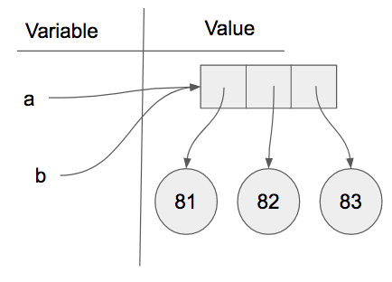

..  Copyright (C)  Brad Miller, David Ranum, Jeffrey Elkner, Peter Wentworth, Allen B. Downey, Chris
    Meyers, and Dario Mitchell.  Permission is granted to copy, distribute
    and/or modify this document under the terms of the GNU Free Documentation
    License, Version 1.3 or any later version published by the Free Software
    Foundation; with Invariant Sections being Forward, Prefaces, and
    Contributor List, no Front-Cover Texts, and no Back-Cover Texts.  A copy of
    the license is included in the section entitled "GNU Free Documentation
    License".

.. qnum::
   :prefix: seqmut-4-
   :start: 1

Aliasing
--------

Since variables refer to objects, if we assign one variable to another, both
variables refer to the same object:

.. activecode:: ac8_4_1
    
    a = [81, 82, 83]
    b = a
    print(a is b)
    
In this case, the reference diagram looks like this:

Because the same list has two different names, ``a`` and ``b``, we say that it
is **aliased**. Changes made with one alias affect the other.  In the codelens example below, you can see that ``a`` and ``b`` refer
to the same list after executing the assignment statement ``b = a``.

.. codelens:: ac8_4_2
    :python: py3
    :showoutput:
    
    a = [81,82,83]
    b = [81,82,83]

    print(a == b)
    print(a is b)

    b = a
    print(a == b)
    print(a is b)

    b[0] = 5
    print(a)
    

Although this behavior can be useful, it is sometimes unexpected or
undesirable. In general, it is safer to avoid aliasing when you are working
with mutable objects. Of course, for immutable objects, there's no problem.
That's why Python is free to alias strings and integers when it sees an opportunity to
economize.

**Check your understanding**

.. mchoice:: question8_4_1
   :answer_a: [4,2,8,6,5]
   :answer_b: [4,2,8,999,5]
   :correct: b
   :feedback_a: blist is not a copy of alist, it is a reference to the list alist refers to.
   :feedback_b: Yes, since alist and blist both reference the same list, changes to one also change the other.
   :practice: T

   What is printed by the following statements?
   
   .. code-block:: python

     alist = [4,2,8,6,5]
     blist = alist
     blist[3] = 999
     print(alist)
