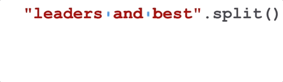

..  Copyright (C)  Brad Miller, David Ranum, Jeffrey Elkner, Peter Wentworth, Allen B. Downey, Chris
    Meyers, and Dario Mitchell.  Permission is granted to copy, distribute
    and/or modify this document under the terms of the GNU Free Documentation
    License, Version 1.3 or any later version published by the Free Software
    Foundation; with Invariant Sections being Forward, Prefaces, and
    Contributor List, no Front-Cover Texts, and no Back-Cover Texts.  A copy of
    the license is included in the section entitled "GNU Free Documentation
    License".

.. qnum::
   :prefix: sequences-9-
   :start: 1

Splitting and Joining Strings
=============================

Two of the most useful methods on strings involve lists of strings. The ``split`` method breaks a string into a list
of words. By default, any number of whitespace characters is considered a word boundary.

.. activecode:: ac5_9_1

    song = "The rain in Spain..."
    wds = song.split()
    print(wds)

An optional argument called a **delimiter** can be used to specify which characters to use as word boundaries.

.. image:: Figures/split_on_e.jpeg
   :alt: shows example of splitting "leaders and best" on "e"

The following example uses the string ``ai`` as the delimiter:

.. activecode:: ac5_9_2

    song = "The rain in Spain..."
    wds = song.split('ai')
    print(wds)

Notice that the delimiter doesn't appear in the result.

The inverse of the ``split`` method is ``join``.  You choose a
desired **separator** string, (often called the *glue*)
and join the list with the glue between each of the elements.

.. image:: Figures/join.gif
   :alt: shows process of a "/" separating the words "leaders", "and", "best"

.. activecode:: ac5_9_3

    wds = ["red", "blue", "green"]
    glue = ';'
    s = glue.join(wds)
    print(s)
    print(wds)

    print("***".join(wds))
    print("".join(wds))

The list that you glue together (``wds`` in this example) is not modified.  Also,
you can use empty glue or multi-character strings as glue.

**Check your understanding**

.. activecode:: ac5_9_4
   :language: python
   :autograde: unittest
   :practice: T

   Create a new list of the 6th through 13th elements of ``lst`` (eight items in all) and assign it to the variable ``output``.
   ~~~~
   lst = ["swimming", 2, "water bottle", 44, "lollipop", "shine", "marsh", "winter", "donkey", "rain", ["Rio", "Beijing", "London"], [1,2,3], "gold", "bronze", "silver", "mathematician", "scientist", "actor", "actress", "win", "cell phone", "leg", "running", "horse", "socket", "plug", ["Phelps", "le Clos", "Lochte"], "drink", 22, "happyfeet", "penguins"]

   =====

   from unittest.gui import TestCaseGui

   class myTests(TestCaseGui):

      def testFour(self):
         self.assertEqual(output, lst[5:13], "Testing that output value is assigned to correct value.")

   myTests().main()

.. activecode:: ac5_9_5
   :language: python
   :autograde: unittest
   :practice: T

   Create a variable ``output`` and assign to it a list whose elements are the words in the string ``str1``.
   ~~~~
   str1 = "OH THE PLACES YOU'LL GO"

   =====

   from unittest.gui import TestCaseGui

   class myTests(TestCaseGui):

      def testSix(self):
         self.assertEqual(output, ["OH", "THE", "PLACES", "YOU'LL", "GO"], "Testing that output value is assigned to correct value.")

   myTests().main()

